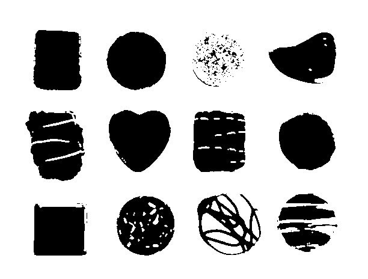

# Aula: Contagem de Objetos em Imagens com OpenCV




## Descrição
Esta aula apresenta uma atividade prática de Processamento Digital de Imagens utilizando a biblioteca OpenCV em Python para contagem de objetos (moedas) em uma imagem.

O código realiza os seguintes passos principais:
1. Carregamento da imagem colorida.
2. Conversão para escala de cinza.
3. Binarização automática usando o método de Otsu.
4. Remoção de ruídos com operações morfológicas (abertura).
5. Inversão da máscara binarizada para destacar os objetos (moedas).
6. Detecção dos contornos dos objetos.
7. Filtragem dos contornos por área mínima para eliminar ruídos.
8. Desenho dos contornos na imagem original.
9. Exibição da máscara e da imagem resultante com contornos desenhados.
10. Impressão do número total de objetos detectados.

---

## Objetivos
- Entender o fluxo básico de segmentação e análise de imagens.
- Praticar técnicas de pré-processamento como binarização e operações morfológicas.
- Utilizar a função `findContours` para identificar objetos em imagens binárias.
- Aplicar filtros para considerar apenas objetos com área significativa.
- Visualizar resultados com `imshow` e manipular janelas OpenCV.

---

## Requisitos
- Python 3.x
- OpenCV (`opencv-python`)

Instalação:
```bash
pip install opencv-python
