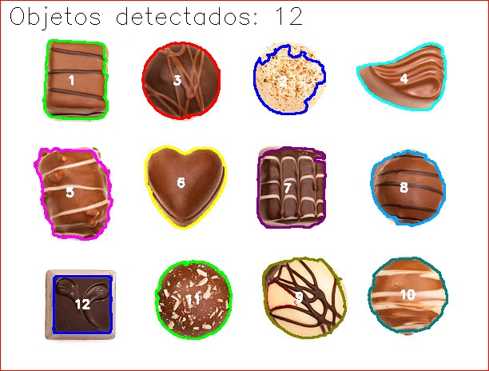
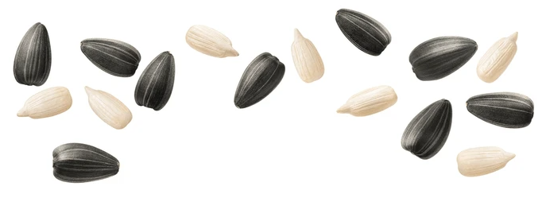
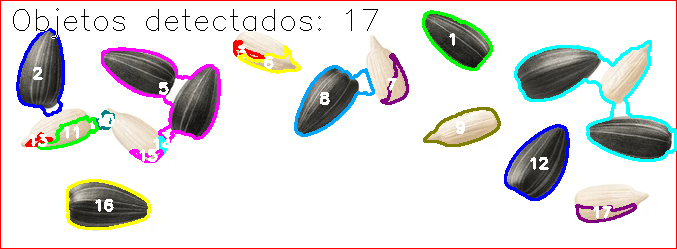

# 🔍 Contagem Avançada de Objetos com OpenCV

[](https://www.python.org/downloads/)
[](https://opencv.org/)
[](https://opensource.org/licenses/MIT)

## 📋 Sobre o Projeto

Este projeto implementa um sistema avançado de contagem de objetos em imagens utilizando técnicas de **Visão Computacional** e **Processamento Digital de Imagens** com OpenCV. O sistema é capaz de detectar e contar objetos de diferentes cores e contrastes, incluindo objetos claros em fundos claros e objetos escuros em fundos diversos.

### 🎯 Principais Características

- **Detecção Dupla**: Identifica objetos claros E escuros simultaneamente
- **Segmentação Avançada**: Usa transformada de distância e algoritmo watershed
- **Redução de Ruído**: Operações morfológicas otimizadas
- **Visualização Rica**: Contornos coloridos, numeração e contagem na imagem
- **Salvamento Automático**: Gera imagens resultantes e máscaras de debug

## 🖼️ Exemplos de Resultados

| Imagem Original | Resultado com Contagem |
|-----------------|------------------------|
|  |  |
|  |  |

## 🚀 Tecnologias Utilizadas

### Técnicas de Processamento de Imagem
- **Binarização Otsu**: Threshold automático para objetos escuros
- **Threshold Adaptativo**: Para objetos com contraste variável
- **Detecção de Bordas Canny**: Para objetos claros com bordas sutis
- **Operações Morfológicas**: Abertura, fechamento e preenchimento
- **Transformada de Distância**: Identificação de centros de objetos
- **Algoritmo Watershed**: Separação de objetos sobrepostos

### Bibliotecas
- **OpenCV (cv2)**: Processamento de imagem e visão computacional
- **NumPy**: Operações matriciais e arrays multidimensionais

## 📦 Instalação

### Pré-requisitos
- Python 3.7 ou superior
- pip (gerenciador de pacotes Python)

### Instalação das Dependências
```bash
# Instalar OpenCV
pip install opencv-python

# Instalar NumPy (geralmente já vem com OpenCV)
pip install numpy

# Ou instalar todas as dependências de uma vez
pip install -r requirements.txt
```

## 🔧 Como Usar

### Execução Básica
```bash
python main.py
```

### Estrutura do Projeto
```
Contagem_objetosCV/
├── .git/                           # Controle de versão Git
├── main.py                         # Script principal
├── requirements.txt                # Dependências do projeto
├── dependencias.txt               # Lista alternativa de dependências
├── readme.md                      # Este arquivo
└── images/                        # Pasta de imagens
    ├── chocolates.jpg             # Imagem original de chocolates
    ├── chocolates_resultado.jpg   # Resultado processado - chocolates
    ├── chocolates_mask_combined.jpg # Máscara combinada - chocolates
    ├── chocolates_mask_dark.jpg   # Máscara objetos escuros - chocolates
    ├── chocolates_mask_light.jpg  # Máscara objetos claros - chocolates
    ├── seeds.png                  # Imagem original de sementes
    ├── seeds_resultado.png        # Resultado processado - sementes
    ├── seeds_mask_combined.png    # Máscara combinada - sementes
    ├── seeds_mask_dark.png        # Máscara objetos escuros - sementes
    ├── seeds_mask_light.png       # Máscara objetos claros - sementes
    ├── gems.jpg                   # Imagem adicional (gemas)
    ├── moedas.jpg                 # Imagem adicional (moedas)
    ├── moedas.png                 # Imagem adicional (moedas PNG)
    └── mask.png                   # Máscara genérica
```

## 🛠️ Funcionalidades Técnicas

### 📁 Arquivos Gerados Automaticamente
O sistema gera automaticamente vários arquivos para debug e análise:

- **`*_resultado.jpg/png`**: Imagem final com contornos coloridos e contagem
- **`*_mask_combined.jpg/png`**: Máscara binária combinada (objetos claros + escuros)
- **`*_mask_dark.jpg/png`**: Máscara apenas dos objetos escuros detectados
- **`*_mask_light.jpg/png`**: Máscara apenas dos objetos claros detectados

### 1. Pré-processamento
- Conversão para escala de cinza
- Suavização Gaussiana para redução de ruído
- Preparação para diferentes tipos de objetos

### 2. Detecção de Objetos Escuros
- Threshold de Otsu automático
- Binarização invertida (objetos escuros como foreground)
- Operações morfológicas para limpeza

### 3. Detecção de Objetos Claros
- Detecção de bordas Canny com thresholds baixos
- Threshold manual agressivo (220+)
- Preenchimento de regiões internas
- Combinação de técnicas para máxima sensibilidade

### 4. Segmentação Avançada
- **Transformada de Distância**: Identifica centros dos objetos
- **Algoritmo Watershed**: Separa objetos sobrepostos ou próximos
- **Marcadores Automáticos**: Sistema de rotulagem inteligente

### 5. Pós-processamento
- Filtro por área mínima (50 pixels)
- Desenho de contornos coloridos
- Numeração sequencial dos objetos
- Contagem total exibida na imagem

## 📊 Parâmetros Configuráveis

### No arquivo `main.py`:
```python
# Área mínima para considerar um objeto (em pixels)
min_area = 50

# Threshold para objetos claros
light_threshold = 220

# Parâmetros do Canny para detecção de bordas
canny_low = 30
canny_high = 80

# Fator da transformada de distância para watershed
distance_factor = 0.3
```

## 🔬 Algoritmo Detalhado

### Fluxo Principal
1. **Carregamento**: Leitura da imagem original
2. **Pré-processamento**: Conversão e suavização
3. **Detecção Dupla**: 
   - Objetos escuros: Otsu + morfologia
   - Objetos claros: Canny + threshold + preenchimento
4. **Combinação**: União das duas máscaras
5. **Watershed**: Segmentação avançada
6. **Contagem**: Análise de contornos com filtros
7. **Visualização**: Desenho e anotação
8. **Salvamento**: Resultado e máscaras de debug

### Tratamento de Casos Especiais
- **Objetos Brancos em Fundo Branco**: Detecção por bordas sutis
- **Objetos Sobrepostos**: Separação por watershed
- **Ruído**: Filtros morfológicos e por área
- **Diferentes Tamanhos**: Kernels adaptativos

## 📈 Resultados Esperados

### Chocolates (chocolates.jpg)
- **Objetos Detectados**: ~12 chocolates
- **Tipos**: Chocolates escuros, brancos e coloridos
- **Desafios**: Diferentes texturas e brilhos

### Sementes (seeds.png)
- **Objetos Detectados**: ~17 sementes
- **Tipos**: Sementes escuras e claras
- **Desafios**: Tamanhos variados e proximidade

## 🔧 Personalização

### Para usar outras imagens do projeto:
O projeto já inclui imagens adicionais que você pode testar:
```python
images_to_process = [
    ('images/chocolates.jpg', 'images/chocolates_resultado.jpg'),
    ('images/seeds.png', 'images/seeds_resultado.png'),
    ('images/gems.jpg', 'images/gems_resultado.jpg'),         
    ('images/moedas.jpg', 'images/moedas_resultado.jpg'),     
    ('images/moedas.png', 'images/moedas_resultado.png'),     
]
```

### Para suas próprias imagens:
1. Adicione suas imagens na pasta `images/`
2. Modifique a lista `images_to_process` em `main.py`:
```python
images_to_process = [
    ('images/sua_imagem.jpg', 'images/sua_imagem_resultado.jpg'),
    # Adicione mais imagens aqui
]
```

### Ajuste de Parâmetros:
- **Objetos muito pequenos**: Reduza `min_area`
- **Objetos muito claros**: Aumente `light_threshold`
- **Bordas fracas**: Diminua `canny_low` e `canny_high`
- **Objetos muito próximos**: Ajuste `distance_factor`

## 🐛 Solução de Problemas

### 🔍 Analisando as Máscaras de Debug
O sistema salva automaticamente máscaras para debug. Para analisar problemas:

1. **Abra as máscaras salvas**:
   - `*_mask_dark`: Mostra apenas objetos escuros detectados
   - `*_mask_light`: Mostra apenas objetos claros detectados  
   - `*_mask_combined`: Mostra a combinação final

2. **Interpretação das máscaras**:
   - **Branco**: Objeto detectado
   - **Preto**: Background/fundo
   - Se um objeto não aparece em branco, não foi detectado

### Objetos não detectados:
- Verifique as máscaras de debug salvas
- Ajuste os parâmetros de threshold
- Considere o pré-processamento da imagem

### Muitos falsos positivos:
- Aumente `min_area`
- Ajuste os kernels morfológicos
- Verifique a qualidade da imagem

### Performance lenta:
- Redimensione imagens muito grandes
- Ajuste o número de iterações morfológicas

## 📝 Licença

Este projeto está sob a licença MIT. Veja o arquivo [LICENSE](LICENSE) para mais detalhes.

## 🤝 Contribuições

Contribuições são bem-vindas! Por favor:
1. Faça um fork do projeto
2. Crie uma branch para sua feature
3. Commit suas mudanças
4. Push para a branch
5. Abra um Pull Request

## 📧 Contato

Para dúvidas, sugestões ou colaborações, entre em contato!

---

**Desenvolvido com ❤️ usando OpenCV e Python**
